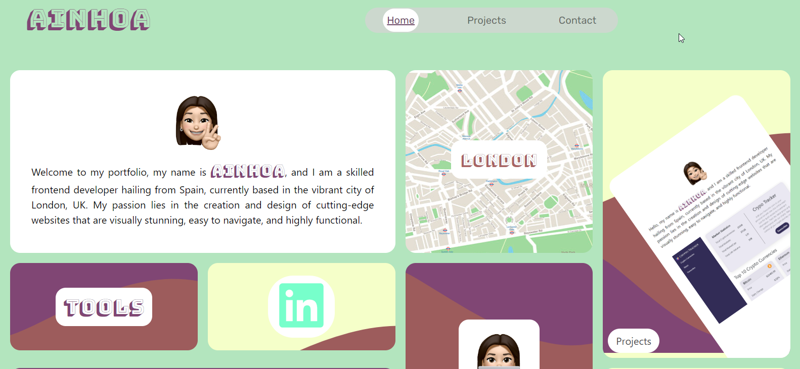
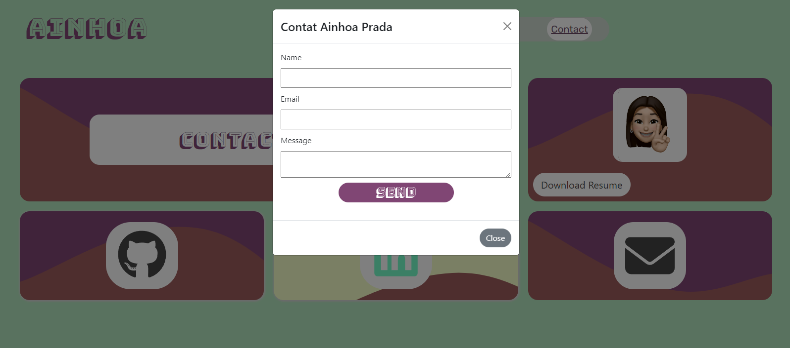

# Ainhoa Prada Portfolio

## Description
My Portfolio is a web application that showcases my projects and skills. I built this project to create a centralized place where I can display my projects, my skills, and my contact information in a visually appealing and easily accessible format. My motivation for creating this portfolio was to showcase my work to potential employers or clients.

This project solves the problem of having to navigate through multiple websites or repositories to view my projects and skills. With My Portfolio, all of the information is organized in one location, making it easy for others to view and evaluate my work.

Through the development of this project, I learned how to use React, JavaScript, and various npm modules to create a dynamic and responsive web application.

## Table of Contents
* [Tools](#tools)
* [Live-Demo](#live-demo)
* [Installation](#installation)
* [Usage](#usage)
* [Credits](#credits)
* [License](#license)
* [Questions](#questions)

## Tools
              

## Live Demo
:point_right:  https://github.com/nowinoa/Ainhoa_Prada_Portfolio  :point_left:

## Installation
To install My Portfolio, follow these steps:

1. Clone this repository onto your local machine.
2. Navigate to the project directory.
3. Install the necessary dependencies by running the command npm install.
4. Start the development server by running the command npm start.
5. Open your web browser and navigate to http://localhost:3000 to view the application.

## Usage
Upon opening the application, you will be directed to the home page. The home page displays my location, tools I use, links to other pages, and a togglable icon that changes image when clicked.

The projects page displays my latest projects, each of which has a button to the uploaded page and another to the code on GitHub.

The contact page allows users to contact me by filling out a contact form. There is also an email option if you prefer to save the contact information for later. Additionally, you can navigate to my LinkedIn and GitHub profiles, and download my PDF curriculum by clicking the button.

## Credits
Created by <a href="https://github.com/nowinoa">Ainhoa Prada</a>.
The following third-party assets were used:

* React
* Bootstrap
* Font Awesome

## License
This project is under MIT license
        

## Questions
For any questions or issues feel free to contact me at: apt.code14@gmail.com

To explore more about my projects visit my profile :point_right: <a href="https://github.com/nowinoa">:computer:</a>

© 2023 Ainhoa Prada. Confidential and Proprietary. All Rights Reserved.
